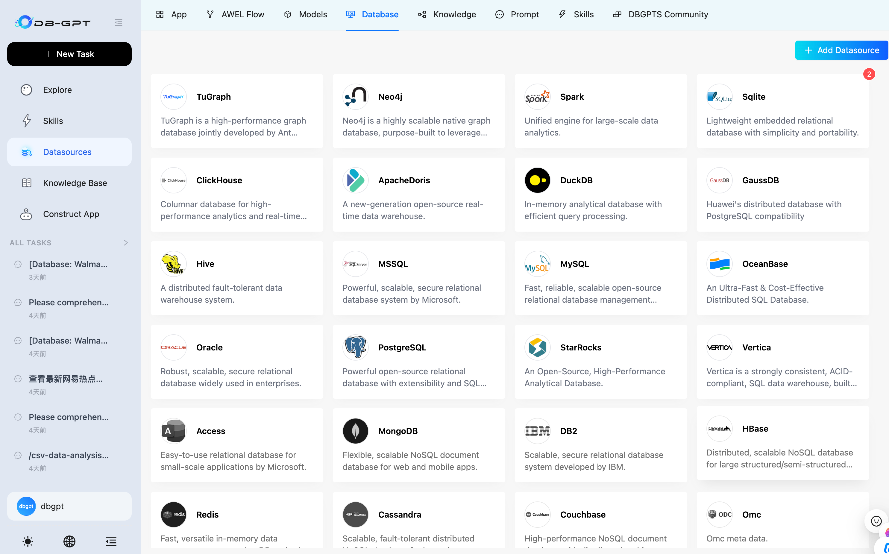

#  DB-GPT: Open-Source Agentic AI Data Assistant

<p align="left">
  
</p>

<div align="center">
  <p>
    <a href="https://github.com/eosphoros-ai/DB-GPT">
        
    </a>
    <a href="https://github.com/eosphoros-ai/DB-GPT">
        
    </a>
    <a href="http://dbgpt.cn/">
        
    </a>
    <a href="https://opensource.org/licenses/MIT">
      
    </a>
     <a href="https://github.com/eosphoros-ai/DB-GPT/releases">
      
    </a>
    <a href="https://github.com/eosphoros-ai/DB-GPT/issues">
      
    </a>
    <a href="https://x.com/DBGPT_AI">
      
    </a>
    <a href="https://medium.com/@dbgpt0506">
      
    </a>
    <a href="https://space.bilibili.com/3537113070963392">
      
    </a>
    <a href="https://join.slack.com/t/slack-inu2564/shared_invite/zt-29rcnyw2b-N~ubOD9kFc7b7MDOAM1otA">
      
    </a>
    <a href="https://codespaces.new/eosphoros-ai/DB-GPT">
      
    </a>
  </p>


[](README.md)
[](README.zh.md)
[](README.ja.md) 

[**Documents**](http://docs.dbgpt.cn/docs/overview/) | [**Contact Us**](https://github.com/eosphoros-ai/DB-GPT/blob/main/README.zh.md#%E8%81%94%E7%B3%BB%E6%88%91%E4%BB%AC) | [**Community**](https://github.com/eosphoros-ai/community) | [**Paper**](https://arxiv.org/pdf/2312.17449.pdf)

</div>

> **An open-source AI data assistant that connects to your data, writes SQL and code, runs skills in sandboxed environments, and turns analysis into reports, insights, and action.**


## What is DB-GPT?

DB-GPT is an open-source **agentic AI data assistant** for the next generation of **AI + Data** products.

It helps users and teams:
- connect to **databases, CSV / Excel files, warehouses, and knowledge bases**
- ask questions in natural language and let AI **write SQL autonomously**
- run **Python- and code-driven analysis** workflows
- load and execute reusable **skills** for domain-specific tasks
- generate **charts, dashboards, HTML reports, and analysis summaries**
- execute tasks safely in **sandboxed environments**

DB-GPT is also a platform for building **AI-native data agents, workflows, and applications** with agents, AWEL, RAG, and multi-model support.

## Why DB-GPT?

### 1. Agentic data analysis
Plan tasks, break work into steps, call tools, and complete analysis workflows end to end.


### 2. Autonomous SQL + code execution
Generate SQL and code to query data, clean datasets, compute metrics, and produce outputs.


### 3. Multi-source data access
Work across structured and unstructured sources, including databases, spreadsheets, documents, and knowledge bases.



### 4. Skills-driven extensibility
Package domain knowledge, analysis methods, and execution workflows into reusable skills.


### 5. Sandboxed execution
Run code and tools in isolated environments for safer, more reliable analysis.


## What you can do with DB-GPT

- **Analyze CSV / Excel files** and generate visual reports
- **Connect to databases** and produce profiling reports
- Ask business questions in natural language and let AI **write SQL automatically**
- Perform **financial report analysis** with code, charts, and narrative summaries
- Create and reuse **SQL analysis skills** and domain workflows
- Combine **code, SQL, retrieval, and tools** in a single agentic workflow
- Build next-generation **AI + Data assistants** for your team or product

## Product Workflow

### Explore data
Connect files, databases, and knowledge bases in one workspace.

### Plan and execute
Let AI reason through the task, write SQL and code, and execute step by step.

### Use skills
Load reusable skills for repeatable business analysis workflows.

### Generate reports
Produce charts, dashboards, HTML reports, and decision-ready outputs.


## Quick Start

Get DB-GPT running in minutes with the one-line installer (macOS & Linux):

```bash
curl -fsSL https://raw.githubusercontent.com/eosphoros-ai/DB-GPT/main/scripts/install/install.sh | bash
```

Or specify a profile and API key directly:

```bash
curl -fsSL https://raw.githubusercontent.com/eosphoros-ai/DB-GPT/main/scripts/install/install.sh \
  | OPENAI_API_KEY=sk-xxx bash -s -- --profile openai
```

For Kimi 2.5 via Moonshot API:

```bash
curl -fsSL https://raw.githubusercontent.com/eosphoros-ai/DB-GPT/main/scripts/install/install.sh \
  | MOONSHOT_API_KEY=sk-xxx bash -s -- --profile kimi
```

For MiniMax via the OpenAI-compatible API:

```bash
curl -fsSL https://raw.githubusercontent.com/eosphoros-ai/DB-GPT/main/scripts/install/install.sh \
  | MINIMAX_API_KEY=sk-xxx bash -s -- --profile minimax
```

Already have a local DB-GPT checkout? Reuse it instead of cloning `~/.dbgpt/DB-GPT`:

```bash
OPENAI_API_KEY=sk-xxx \
  bash scripts/install/install.sh --profile openai --repo-dir "$(pwd)" --yes
```

Or reuse your local repo with Kimi 2.5:

```bash
MOONSHOT_API_KEY=sk-xxx \
  bash scripts/install/install.sh --profile kimi --repo-dir "$(pwd)" --yes
```

Or reuse your local repo with MiniMax:

```bash
MINIMAX_API_KEY=sk-xxx \
  bash scripts/install/install.sh --profile minimax --repo-dir "$(pwd)" --yes
```

After installation, start the server with the generated profile config:

```bash
cd ~/.dbgpt/DB-GPT && uv run dbgpt start webserver --profile <profile>
```

Then open [http://localhost:5670](http://localhost:5670).

> **Prefer to review the script first?**
> ```bash
> curl -fsSL https://raw.githubusercontent.com/eosphoros-ai/DB-GPT/main/scripts/install/install.sh -o install.sh
> less install.sh
> bash install.sh --profile openai
> ```

### Install via PyPI

Install DB-GPT from PyPI and start it with a single command — no source checkout required.

> **Prerequisites:** Python **3.10+** and [uv](https://docs.astral.sh/uv/getting-started/installation/) (recommended) or pip.

**1. Install**

```bash
# Recommended: use uv
uv pip install dbgpt-app

# Or with pip
pip install dbgpt-app
```

The default installation includes the core framework (CLI, FastAPI, Agent), OpenAI-compatible LLM support, DashScope / Tongyi support, RAG document parsing, and ChromaDB vector store.

**2. Start**

```bash
dbgpt start
```

On first run, an interactive setup wizard will guide you through choosing an LLM provider and entering your API key. Once complete, the web server starts automatically.

**3. Open the Web UI**

Visit [http://localhost:5670](http://localhost:5670) — you're all set! 🎉

### Advanced Installation


For Docker, local GPU models (vLLM, llama.cpp), or manual source-code setup, see the full docs:

- [**Install**](http://docs.dbgpt.cn/docs/installation)
  - [Docker](http://docs.dbgpt.cn/docs/installation/docker)
  - [Source Code](http://docs.dbgpt.cn/docs/installation/sourcecode)
- [**Quickstart**](http://docs.dbgpt.cn/docs/quickstart)
- [**Application**](http://docs.dbgpt.cn/docs/operation_manual)
  - [Development Guide](http://docs.dbgpt.cn/docs/cookbook/app/data_analysis_app_develop)
  - [App Usage](http://docs.dbgpt.cn/docs/application/app_usage)
  - [AWEL Flow Usage](http://docs.dbgpt.cn/docs/application/awel_flow_usage)
- [**Debugging**](http://docs.dbgpt.cn/docs/operation_manual/advanced_tutorial/debugging)
- [**Advanced Usage**](http://docs.dbgpt.cn/docs/application/advanced_tutorial/cli)
  - [SMMF](http://docs.dbgpt.cn/docs/application/advanced_tutorial/smmf)
  - [Finetune](http://docs.dbgpt.cn/docs/application/fine_tuning_manual/dbgpt_hub)
  - [AWEL](http://docs.dbgpt.cn/docs/awel/tutorial)


## Core Capabilities

### Agentic Analysis
- task planning
- step-by-step execution
- tool use
- iterative reasoning

### SQL + Code Execution
- natural language to SQL
- Python-based analysis and transformation
- metric calculation
- chart generation

### Multi-Source Data Access
- relational databases
- CSV / Excel
- documents
- knowledge bases
- mixed-source workflows

### Skills and Agents
- reusable skills
- domain workflows
- agent orchestration
- customizable execution flows

### Reporting and Decision Support
- database profiling reports
- financial analysis reports
- visual reports and dashboards
- summaries and business insights

### Safe Execution
- sandboxed code execution
- controlled tool use
- reproducible outputs and artifacts

#### Text2SQL Finetune

  |     LLM     |  Supported  | 
  |:-----------:|:-----------:|
  |    LLaMA    |      ✅     |
  |   LLaMA-2   |      ✅     | 
  |    BLOOM    |      ✅     | 
  |   BLOOMZ    |      ✅     | 
  |   Falcon    |      ✅     | 
  |  Baichuan   |      ✅     | 
  |  Baichuan2  |      ✅     | 
  |  InternLM   |      ✅     |
  |    Qwen     |      ✅     | 
  |   XVERSE    |      ✅     | 
  |  ChatGLM2   |      ✅     |

[More Information about Text2SQL finetune](https://github.com/eosphoros-ai/DB-GPT-Hub)

### Supported Models

<table>
      <thead>
        <tr>
          <th>Provider</th>
          <th>Supported</th>
          <th>Models</th>
        </tr>
      </thead>
      <tbody>
        <tr>
          <td align="center" valign="middle">DeepSeek</td>
          <td align="center" valign="middle">✅</td>
          <td>
            🔥🔥🔥  <a href="https://huggingface.co/deepseek-ai/DeepSeek-R1-0528">DeepSeek-R1-0528</a><br/>
            🔥🔥🔥  <a href="https://huggingface.co/deepseek-ai/DeepSeek-V3-0324">DeepSeek-V3-0324</a><br/>
            🔥🔥🔥  <a href="https://huggingface.co/deepseek-ai/DeepSeek-R1">DeepSeek-R1</a><br/>
            🔥🔥🔥  <a href="https://huggingface.co/deepseek-ai/DeepSeek-V3">DeepSeek-V3</a><br/>
            🔥🔥🔥  <a href="https://huggingface.co/deepseek-ai/DeepSeek-R1-Distill-Llama-70B">DeepSeek-R1-Distill-Llama-70B</a><br/>
            🔥🔥🔥  <a href="https://huggingface.co/deepseek-ai/DeepSeek-R1-Distill-Qwen-32B">DeepSeek-R1-Distill-Qwen-32B</a><br/>
            🔥🔥🔥  <a href="https://huggingface.co/deepseek-ai/DeepSeek-Coder-V2-Instruct">DeepSeek-Coder-V2-Instruct</a><br/>
          </td>
        </tr>
        <tr>
          <td align="center" valign="middle">Qwen</td>
          <td align="center" valign="middle">✅</td>
          <td>
            🔥🔥🔥  <a href="https://huggingface.co/Qwen/Qwen3-235B-A22B">Qwen3-235B-A22B</a><br/>
            🔥🔥🔥  <a href="https://huggingface.co/Qwen/Qwen3-30B-A3B">Qwen3-30B-A3B</a><br/>
            🔥🔥🔥  <a href="https://huggingface.co/Qwen/Qwen3-32B">Qwen3-32B</a><br/>
            🔥🔥🔥  <a href="https://huggingface.co/Qwen/QwQ-32B">QwQ-32B</a><br/>
            🔥🔥🔥  <a href="https://huggingface.co/Qwen/Qwen2.5-Coder-32B-Instruct">Qwen2.5-Coder-32B-Instruct</a><br/>
            🔥🔥🔥  <a href="https://huggingface.co/Qwen/Qwen2.5-Coder-14B-Instruct">Qwen2.5-Coder-14B-Instruct</a><br/>
            🔥🔥🔥  <a href="https://huggingface.co/Qwen/Qwen2.5-72B-Instruct">Qwen2.5-72B-Instruct</a><br/>
            🔥🔥🔥  <a href="https://huggingface.co/Qwen/Qwen2.5-32B-Instruct">Qwen2.5-32B-Instruct</a><br/>
          </td>
        </tr>
        <tr>
          <td align="center" valign="middle">GLM</td>
          <td align="center" valign="middle">✅</td>
          <td>
            🔥🔥🔥  <a href="https://huggingface.co/THUDM/GLM-Z1-32B-0414">GLM-Z1-32B-0414</a><br/>
            🔥🔥🔥  <a href="https://huggingface.co/THUDM/GLM-4-32B-0414">GLM-4-32B-0414</a><br/>
            🔥🔥🔥  <a href="https://huggingface.co/THUDM/glm-4-9b-chat">Glm-4-9b-chat</a>
          </td>
        </tr>
        <tr>
          <td align="center" valign="middle">Llama</td>
          <td align="center" valign="middle">✅</td>
          <td>
            🔥🔥🔥  <a href="https://huggingface.co/meta-llama/Meta-Llama-3.1-405B-Instruct">Meta-Llama-3.1-405B-Instruct</a><br/>
            🔥🔥🔥  <a href="https://huggingface.co/meta-llama/Meta-Llama-3.1-70B-Instruct">Meta-Llama-3.1-70B-Instruct</a><br/>
            🔥🔥🔥  <a href="https://huggingface.co/meta-llama/Meta-Llama-3.1-8B-Instruct">Meta-Llama-3.1-8B-Instruct</a><br/>
            🔥🔥🔥  <a href="https://huggingface.co/meta-llama/Meta-Llama-3-70B-Instruct">Meta-Llama-3-70B-Instruct</a><br/>
            🔥🔥🔥  <a href="https://huggingface.co/meta-llama/Meta-Llama-3-8B-Instruct">Meta-Llama-3-8B-Instruct</a>
          </td>
        </tr>
        <tr>
          <td align="center" valign="middle">Gemma</td>
          <td align="center" valign="middle">✅</td>
          <td>
            🔥🔥🔥  <a href="https://huggingface.co/google/gemma-2-27b-it">gemma-2-27b-it</a><br>
            🔥🔥🔥  <a href="https://huggingface.co/google/gemma-2-9b-it">gemma-2-9b-it</a><br>
            🔥🔥🔥  <a href="https://huggingface.co/google/gemma-7b-it">gemma-7b-it</a><br>
            🔥🔥🔥  <a href="https://huggingface.co/google/gemma-2b-it">gemma-2b-it</a>
          </td>
        </tr>
        <tr>
          <td align="center" valign="middle">Yi</td>
          <td align="center" valign="middle">✅</td>
          <td>
            🔥🔥🔥  <a href="https://huggingface.co/01-ai/Yi-1.5-34B-Chat">Yi-1.5-34B-Chat</a><br/>
            🔥🔥🔥  <a href="https://huggingface.co/01-ai/Yi-1.5-9B-Chat">Yi-1.5-9B-Chat</a><br/>
            🔥🔥🔥  <a href="https://huggingface.co/01-ai/Yi-1.5-6B-Chat">Yi-1.5-6B-Chat</a><br/>
            🔥🔥🔥  <a href="https://huggingface.co/01-ai/Yi-34B-Chat">Yi-34B-Chat</a>
          </td>
        </tr>
        <tr>
          <td align="center" valign="middle">Starling</td>
          <td align="center" valign="middle">✅</td>
          <td>
            🔥🔥🔥  <a href="https://huggingface.co/Nexusflow/Starling-LM-7B-beta">Starling-LM-7B-beta</a>
          </td>
        </tr>
        <tr>
          <td align="center" valign="middle">SOLAR</td>
          <td align="center" valign="middle">✅</td>
          <td>
            🔥🔥🔥  <a href="https://huggingface.co/upstage/SOLAR-10.7B-Instruct-v1.0">SOLAR-10.7B</a>
          </td>
        </tr>
        <tr>
          <td align="center" valign="middle">Mixtral</td>
          <td align="center" valign="middle">✅</td>
          <td>
            🔥🔥🔥  <a href="https://huggingface.co/mistralai/Mixtral-8x7B-Instruct-v0.1">Mixtral-8x7B</a>
          </td>
        </tr>
        <tr>
          <td align="center" valign="middle">Phi</td>
          <td align="center" valign="middle">✅</td>
          <td>
            🔥🔥🔥  <a href="https://huggingface.co/collections/microsoft/phi-3-6626e15e9585a200d2d761e3">Phi-3</a>
          </td>
        </tr>
      </tbody>
    </table>

  - [More Supported LLMs](http://docs.dbgpt.site/docs/modules/smmf)

### Privacy and Security

We protect data privacy and execution safety through private model deployment, proxy desensitization, and sandboxed execution mechanisms.

### Data Sources
- [Datasources](http://docs.dbgpt.cn/docs/modules/connections)

## Vision

We believe the future of data products goes beyond dashboards.

The next generation of **AI + Data** products will be:
- **agentic**
- **multi-source**
- **skill-driven**
- **sandboxed**
- capable of writing **SQL and code**
- able to turn analysis into **reports, decisions, and action**

DB-GPT aims to help developers and enterprises build that future.


## Contribution

- To check detailed guidelines for new contributions, please refer [how to contribute](https://github.com/eosphoros-ai/DB-GPT/blob/main/CONTRIBUTING.md)

### Contributors Wall
<a href="https://github.com/eosphoros-ai/DB-GPT/graphs/contributors">
  
</a>


## Licence
The MIT License (MIT)

## DISCKAIMER
- [disckaimer](./DISCKAIMER.md)

## Citation
If you want to understand the overall architecture of DB-GPT, please cite <a href="https://arxiv.org/abs/2312.17449" target="_blank">Paper</a> and <a href="https://arxiv.org/abs/2404.10209" target="_blank">Paper</a>

If you want to learn about using DB-GPT for Agent development, please cite the <a href="https://arxiv.org/abs/2412.13520" target="_blank">Paper</a>
```bibtex
@article{xue2023dbgpt,
      title={DB-GPT: Empowering Database Interactions with Private Large Language Models}, 
      author={Siqiao Xue and Caigao Jiang and Wenhui Shi and Fangyin Cheng and Keting Chen and Hongjun Yang and Zhiping Zhang and Jianshan He and Hongyang Zhang and Ganglin Wei and Wang Zhao and Fan Zhou and Danrui Qi and Hong Yi and Shaodong Liu and Faqiang Chen},
      year={2023},
      journal={arXiv preprint arXiv:2312.17449},
      url={https://arxiv.org/abs/2312.17449}
}
@misc{huang2024romasrolebasedmultiagentdatabase,
      title={ROMAS: A Role-Based Multi-Agent System for Database monitoring and Planning}, 
      author={Yi Huang and Fangyin Cheng and Fan Zhou and Jiahui Li and Jian Gong and Hongjun Yang and Zhidong Fan and Caigao Jiang and Siqiao Xue and Faqiang Chen},
      year={2024},
      eprint={2412.13520},
      archivePrefix={arXiv},
      primaryClass={cs.AI},
      url={https://arxiv.org/abs/2412.13520}, 
}
@inproceedings{xue2024demonstration,
      title={Demonstration of DB-GPT: Next Generation Data Interaction System Empowered by Large Language Models}, 
      author={Siqiao Xue and Danrui Qi and Caigao Jiang and Wenhui Shi and Fangyin Cheng and Keting Chen and Hongjun Yang and Zhiping Zhang and Jianshan He and Hongyang Zhang and Ganglin Wei and Wang Zhao and Fan Zhou and Hong Yi and Shaodong Liu and Hongjun Yang and Faqiang Chen},
      year={2024},
      booktitle = "Proceedings of the VLDB Endowment",
      url={https://arxiv.org/abs/2404.10209}
}
```


## Contact Information
Thanks to everyone who has contributed to DB-GPT! Your ideas, code, comments, and even sharing them at events and on social platforms can make DB-GPT better.
We are working on building a community, if you have any ideas for building the community, feel free to contact us.  

- [Github Issues](https://github.com/eosphoros-ai/DB-GPT/issues) ⭐️：For questions about using GB-DPT, see the CONTRIBUTING.  
- [Github Discussions](https://github.com/orgs/eosphoros-ai/discussions) ⭐️：Share your experience or unique apps.  
- [Twitter](https://x.com/DBGPT_AI) ⭐️：Please feel free to talk to us.  


[](https://star-history.com/#csunny/DB-GPT)


好的，我已经完成了对dbgpt项目的详细分析。以下是完整的解读：

## DB-GPT项目结构

DB-GPT是一个开源的AI数据助理项目，采用前后端分离架构：

**后端架构：**
- `/home/ysq/code/crj/dbgpt/packages/dbgpt-app/` - 主应用包
- `/home/ysq/code/crj/dbgpt/packages/dbgpt-core/` - 核心功能
- `/home/ysq/code/crj/dbgpt/packages/dbgpt-serve/` - 服务模块

**前端架构：**
- `/home/ysq/code/crj/dbgpt/web/` - Next.js前端应用

---

## 五个按钮功能的前后端代码对应关系

### 1. **技能 (Skills)**

**前端：**
- **主路由**: `/home/ysq/code/crj/dbgpt/web/pages/construct/skills/`
- **主要文件**: 
  - `index.tsx` - 技能管理页面
  - `new-components/layout/Construct.tsx` (第71-75行) - 导航Tab定义
  - `pages/index.tsx` (多处引用) - 技能选择器UI
  - **API调用**: `/home/ysq/code/crj/dbgpt/web/client/api/agentic_data_api.ts`
  ```typescript
  // 前端API路径
  GET /api/v1/skills/list
  GET /api/v1/skills/detail
  POST /api/v1/skills/upload
  POST /api/v1/skills/import_github
  GET /api/v1/agent/skills/download
  ```

**后端：**
- **主要文件**: `/home/ysq/code/crj/dbgpt/packages/dbgpt-app/src/dbgpt_app/openapi/api_v1/agentic_data_api.py`
- **API端点**:
  - 第141行: `GET /v1/skills/list` - 获取技能列表
  - 第224行: `GET /v1/skills/detail` - 获取技能详情
  - 第380行: `POST /v1/skills/upload` - 上传技能
  - 第671行: `POST /v1/skills/import_github` - 从GitHub导入技能
  - 第3423行: `GET /v1/agent/skills/download` - 下载技能

---

### 2. **数据源 (Datasources)**

**前端：**
- **主路由**: `/home/ysq/code/crj/dbgpt/web/pages/construct/database.tsx`
- **主要文件**: 
  - `pages/index.tsx` (多处引用) - 数据库选择器UI
  - **API调用**: `/home/ysq/code/crj/dbgpt/web/client/api/request.ts` (第83-101行)
  ```typescript
  GET /api/v2/serve/datasources - 获取数据源列表
  GET /api/v2/serve/datasource-types - 获取支持的数据源类型
  DELETE /api/v2/serve/datasources/{id} - 删除数据源
  PUT /api/v2/serve/datasources - 更新数据源
  POST /api/v2/serve/datasources - 创建数据源
  POST /api/v2/serve/datasources/test-connection - 测试连接
  POST /api/v2/serve/datasources/{id}/refresh - 刷新数据源
  ```

**后端：**
- **主要文件**: `/home/ysq/code/crj/dbgpt/packages/dbgpt-app/src/dbgpt_app/openapi/api_v2.py`
- **API端点**:
  - `/api/v2/serve/datasources` - 数据源管理API
  - 涉及数据库连接、测试、CRUD操作等

---

### 3. **探索广场 (Explore Square)**

**前端：**
- **主路由**: `/home/ysq/code/crj/dbgpt/web/pages/construct/dbgpts/`
- **主要文件**: 
  - `new-components/layout/Construct.tsx` (第77-81行) - 导航Tab定义
  - **dbgpts_community** tab指向 `/dbgpts` 路由

**后端：**
- **相关文件**: `/home/ysq/code/crj/dbgpt/packages/dbgpt-app/src/dbgpt_app/openapi/` 下的多个API
- 主要提供社区技能和应用模板的浏览功能

---

### 4. **知识库 (Knowledge Base)**

**前端：**
- **主路由**: 
  - `/home/ysq/code/crj/dbgpt/web/pages/knowledge/` - 知识库浏览
  - `/home/ysq/code/crj/dbgpt/web/pages/construct/knowledge/` - 知识库管理
- **主要文件**: 
  - `pages/index.tsx` (多处引用) - 知识库选择器UI
  - `client/api/knowledge/index.ts` - 知识库API封装
  ```typescript
  GET /knowledge/{spaceName}/document/list - 文档列表
  POST /knowledge/{spaceName}/document/add - 添加文档
  POST /knowledge/{spaceName}/document/edit - 编辑文档
  POST /knowledge/{spaceName}/document/delete - 删除文档
  POST /knowledge/{spaceName}/document/upload - 上传文档
  POST /knowledge/{spaceName}/document/sync - 同步文档
  POST /knowledge/space/add - 创建知识空间
  POST /knowledge/space/list - 知识空间列表
  POST /knowledge/space/delete - 删除知识空间
  ```

**后端：**
- **主要文件**: 
  - `/home/ysq/code/crj/dbgpt/packages/dbgpt-app/src/dbgpt_app/knowledge/api.py`
  - `/home/ysq/code/crj/dbgpt/packages/dbgpt-app/src/dbgpt_app/knowledge/service.py`
- **API端点** (共30+个):
  - 第83行: `POST /knowledge/space/add` - 添加知识空间
  - 第95行: `POST /knowledge/space/list` - 知识空间列表
  - 第108行: `POST /knowledge/space/delete` - 删除知识空间
  - 第221行: `POST /knowledge/{space_name}/document/add` - 添加文档
  - 第369行: `POST /knowledge/{space_name}/document/delete` - 删除文档
  - 第450行: `POST /knowledge/{space_name}/document/sync` - 同步文档
  - 等等...

---

### 5. **应用管理 (App Management)**

**前端：**
- **主路由**: `/home/ysq/code/crj/dbgpt/web/pages/construct/`
- **子路由**:
  - `/app` - 应用管理
  - `/flow` - AWEL流程编排
  - `/models` - 模型管理
  - `/database` - 数据库管理
  - `/knowledge` - 知识库管理
  - `/prompt` - Prompt管理
  - `/skills` - 技能管理
  - `/dbgpts` - 探索广场
- **主要文件**: `new-components/layout/Construct.tsx` (第18-82行)
  - 定义了整个Construct模块的Tab导航结构

**后端：**
- **相关文件**: 
  - `/home/ysq/code/crj/dbgpt/packages/dbgpt-app/src/dbgpt_app/openapi/` 下的多个API
  - 包括应用管理、流程编排、模型配置等API

---

## 如何删除这些按钮功能

如果你想删除这5个按钮功能，只保留**对话**和**任务历史记录**，可以按以下步骤操作：

### 方法一：前端隐藏（推荐）

编辑文件：`/home/ysq/code/crj/dbgpt/web/new-components/layout/Construct.tsx`

注释掉或删除以下Tab项（第18-82行的items数组中的对应项）：

```typescript
// 注释掉这些行
{
  key: 'app',
  name: t('App'),
  path: '/app',
  icon: <AppstoreOutlined />,
},
// ... 其他需要删除的项
```

### 方法二：前端完全移除

1. **注释掉技能相关UI**：
   - 文件：`/home/ysq/code/crj/dbgpt/web/pages/index.tsx`
   - 搜索并注释：技能选择器Popover、ThunderboltOutlined按钮等

2. **注释掉数据源相关UI**：
   - 文件：`/home/ysq/code/crj/dbgpt/web/pages/index.tsx`
   - 搜索并注释：数据源选择器Popover、DatabaseOutlined按钮等

3. **注释掉知识库相关UI**：
   - 文件：`/home/ysq/code/crj/dbgpt/web/pages/index.tsx`
   - 搜索并注释：知识库选择器Popover、BookOutlined按钮等

4. **注释掉导航Tab**：
   - 文件：`/home/ysq/code/crj/dbgpt/web/new-components/layout/Construct.tsx`
   - 注释掉不需要的Tab项

5. **注释掉路由**（可选，如果完全不需要这些功能）：
   ```bash
   # 可以注释掉或删除这些目录：
   # /home/ysq/code/crj/dbgpt/web/pages/construct/
   # /home/ysq/code/crj/dbgpt/web/pages/knowledge/
   ```

### 方法三：后端禁用API（可选）

如果你还想在后端禁用这些功能，可以：

1. **注释掉知识库API**：编辑 `/home/ysq/code/crj/dbgpt/packages/dbgpt-app/src/dbgpt_app/knowledge/api.py`

2. **注释掉技能API**：编辑 `/home/ysq/code/crj/dbgpt/packages/dbgpt-app/src/dbgpt_app/openapi/api_v1/agentic_data_api.py`

3. **注释掉数据源API**：编辑 `/home/ysq/code/crj/dbgpt/packages/dbgpt-app/src/dbgpt_app/openapi/api_v2.py`

---

## 保留的功能

按照你的需求，保留的功能应该包括：

1. ✅ **对话功能** - `/home/ysq/code/crj/dbgpt/web/pages/chat/` 和 `/home/ysq/code/crj/dbgpt/web/pages/index.tsx`
2. ✅ **任务历史记录** - 左侧边栏 `/home/ysq/code/crj/dbgpt/web/new-components/chat/sider/ChatSider.tsx`
3. ✅ **模型选择器** - 保留在主页面
4. ✅ **基础UI组件** - Header、UserBar等

---

## 建议

1. **只做前端隐藏**是最安全的方式，不会影响系统的其他功能
2. 如果确定不再使用这些功能，可以一并删除对应的前端页面目录
3. 建议先在前端做修改测试，确保不影响核心对话功能
4. 后端API可以保留（不影响前端使用），将来可能还会用到

需要我帮你实施具体的删除操作吗？


## 五、完整替换操作指南

### 替换清单

#### 1. Logo图片替换
**文件位置**：
```
/home/ysq/code/crj/dbgpt/web/public/
├── LOGO.png → 替换为你的品牌logo
├── LOGO_1.png → 替换为你的品牌logo
├── LOGO_SMALL.png → 替换为你的品牌logo（小尺寸）
├── logo_s_latest.png → 替换为深色主题logo
├── logo_zh_latest.png → 替换为浅色主题logo
└── favicon.ico → 替换为你的favicon
```

**建议**：
- 保持文件名不变，这样不需要修改代码
- 替换logo时保持相同的尺寸比例
- favicon.ico建议使用32x32或16x16像素

#### 2. 前端代码修改

##### 2.1 SEO和页面标题
**文件**：`/home/ysq/code/crj/dbgpt/web/pages/_document.tsx`
```tsx
// 第43行
<meta property='og:title' content='DB-GPT' />  // 改为: <meta property='og:title' content='你的品牌名' />
```

##### 2.2 分享页面
**文件**：`/home/ysq/code/crj/dbgpt/web/pages/share/[token].tsx`
- 第620行：修改"· DB-GPT 回放"为"· 你的品牌 回放"
- 第621行：修改"DB-GPT 对话回放"为"你的品牌 对话回放"
- 第632行：修改"DB-GPT"为你的品牌名

##### 2.3 Playground页面
**文件**：`/home/ysq/code/crj/dbgpt/web/pages/playground.tsx`
- 第202行：修改`title='DB-GPT Playground'`为`title='你的品牌 Playground'`

##### 2.4 Logo alt文本
**文件**：
- `pages/index.tsx` (第2826、3472行)
- `components/layout/side-bar.tsx` (第303、372行)

将所有`alt='DB-GPT'`改为`alt='你的品牌名'`

#### 3. 国际化文本修改

##### 3.1 中文文本
**文件**：`/home/ysq/code/crj/dbgpt/web/locales/zh/common.ts`
```typescript
// 第115行
'DB-GPT支持数据库交互和基于文档的对话...' → '你的品牌支持数据库交互...'

// 第369行
'dbgpts_community: 'DBGPTS社区'' → 'dbgpts_community: '你的品牌社区''

// 第370行
'community_dbgpts: '社区DBGPTS'' → 'community_dbgpts: '社区你的品牌''

// 第371行
'my_dbgpts: '我的DBGPTS'' → 'my_dbgpts: '我的你的品牌''

// 第456行
'home_title: 'DB-GPT AI数据助理'' → 'home_title: '你的品牌 AI数据助理''
```

**文件**：`/home/ysq/code/crj/dbgpt/web/locales/zh/chat.ts`
```typescript
// 第64行
'db_gpt_computer: 'DB-GPT 的电脑'' → 'db_gpt_computer: '你的品牌 的电脑''

// 第83行
'db_gpt_thinking: 'DB-GPT 正在思考 ···'' → 'db_gpt_thinking: '你的品牌 正在思考 ···''

// 第85行
'replay_page_title: 'DB-GPT 对话回放'' → 'replay_page_title: '你的品牌 对话回放''

// 第86行
'replay_page_title_with_question: '{{question}} · DB-GPT 回放'' → 'replay_page_title_with_question: '{{question}} · 你的品牌 回放''
```

##### 3.2 英文文本
**文件**：`/home/ysq/code/crj/dbgpt/web/locales/en/common.ts`
```typescript
// 第108行
'DB-GPT also offers a user-friendly...' → '你的品牌 also offers a user-friendly...'

// 第364-366行
'dbgpts_community: 'DBGPTS Community'' → 'dbgpts_community: '你的品牌 Community''
'community_dbgpts: 'Community DBGPTS'' → 'community_dbgpts: 'Community 你的品牌''
'my_dbgpts: 'My DBGPTS'' → 'my_dbgpts: 'My 你的品牌''

// 第453行
'home_title: 'DB-GPT AI Data Assistant'' → 'home_title: '你的品牌 AI Data Assistant''
```

**文件**：`/home/ysq/code/crj/dbgpt/web/locales/en/chat.ts`
```typescript
// 第56行
'db_gpt_computer: "DB-GPT's Computer"' → 'db_gpt_computer: "你的品牌's Computer"'

// 第75行
'db_gpt_thinking: 'DB-GPT is thinking...'' → 'db_gpt_thinking: '你的品牌 is thinking...''

// 第77-78行
'replay_page_title: 'DB-GPT Conversation Replay'' → 'replay_page_title: '你的品牌 Conversation Replay''
'replay_page_title_with_question: '{{question}} · DB-GPT Replay'' → 'replay_page_title_with_question: '{{question}} · 你的品牌 Replay''
```

#### 4. 技术标签和类名（可选）

这些是技术标识符，影响较小，但如果你想完全品牌化，可以修改：

##### 4.1 DBGPTView 类型定义
**文件**：
- `/home/ysq/code/crj/dbgpt/web/components/chat/chat-content/index.tsx` (第34行)
- `/home/ysq/code/crj/dbgpt/web/new-components/chat/content/ChatContent.tsx` (第43行)
- `/home/ysq/code/crj/dbgpt/web/pages/mobile/chat/components/ChatDialog.tsx` (第10行)

将所有`type DBGPTView`改为`type YourBrandView`

##### 4.2 localStorage键名
**文件**：
- `/home/ysq/code/crj/dbgpt/web/components/chat/completion.tsx` (第78、91行)
- `/home/ysq/code/crj/dbgpt/web/pages/chat/index.tsx` (第297、300、431、436行)

将所有`dbgpt_prompt_code_${chatId}`改为`yourbrand_prompt_code_${chatId}`

##### 4.3 Flow导出标签
**文件**：
- `/home/ysq/code/crj/dbgpt/web/components/flow/canvas-modal/export-flow-modal.tsx` (第73行)
- `/home/ysq/code/crj/dbgpt/web/components/flow/flow-card.tsx` (第78行)
- `/home/ysq/code/crj/dbgpt/web/pages/construct/flow/index.tsx` (第225行)

将所有`DBGPTS`或`DBGPT-WEB`改为你的品牌标识

#### 5. 后端提示词（可选）

**好消息**：在后端提示词中**没有发现**"DB-GPT"字样。如果你确认需要检查，运行：

```bash
grep -rn "DB-GPT\|DBGPT" /home/ysq/code/crj/dbgpt/packages/dbgpt-app/src/dbgpt_app/scene/
grep -rn "DB-GPT\|DBGPT" /home/ysq/code/crj/dbgpt/packages/dbgpt-core/src/dbgpt/agent/
```

---

## 六、建议的替换优先级

### 高优先级（用户可见）
1. ✅ Logo图片文件
2. ✅ 国际化文本（中英文）
3. ✅ SEO标题和页面标题
4. ✅ 分享页面文本

### 中优先级（技术标识）
5. ⚠️ Flow导出标签
6. ⚠️ localStorage键名

### 低优先级（内部类型定义）
7. 🔧 DBGPTView类型名

### 无需修改
8. ❌ 后端提示词（已确认无DB-GPT字样）

---

## 七、快速替换脚本示例

```bash
#!/bin/bash
# 替换中文文本中的DB-GPT
cd /home/ysq/code/crj/dbgpt/web/locales/zh

# 替换 common.ts
sed -i 's/DB-GPT/你的品牌/g' common.ts
sed -i 's/DBGPTS/你的品牌S/g' common.ts

# 替换 chat.ts
sed -i 's/DB-GPT/你的品牌/g' chat.ts

# 替换英文文本
cd ../en
sed -i 's/DB-GPT/YourBrand/g' common.ts
sed -i 's/DB-GPT/YourBrand/g' chat.ts
sed -i 's/DBGPTS/YourBrands/g' common.ts
```


